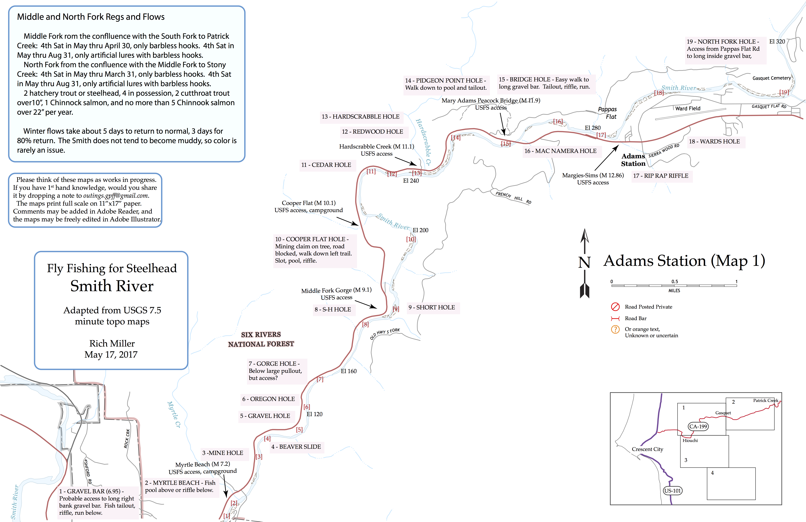
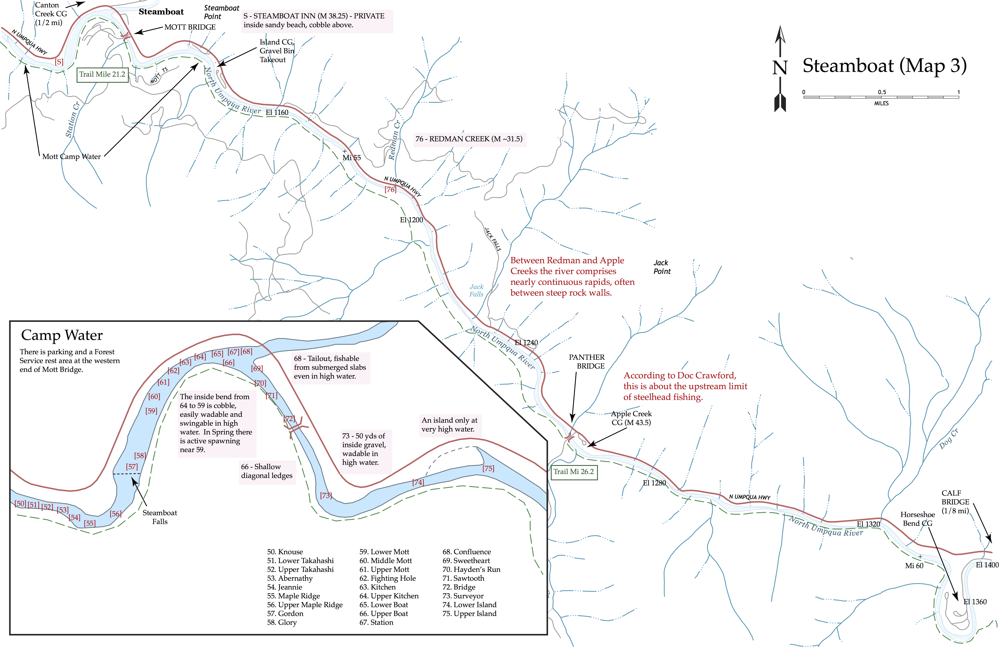

[Home](https://rhexman.github.io) > [Steelhead](https://rhexman.github.io/Steelhead/)

### __Download the maps by pressing the "View on GitHub" button in the header above, and then the green Download button on the right top of the github window.__

## River access and fishing maps

This is series of fishing maps emphasizing wading and swinging flies for steelhead that are provided in the form of scalable vector graphics PDF files.  Consequently, they display in almost any viewer, print in full quality at any resolution, and are readily editable in a number of free open source editors (eg, Inkscape) as well as the widely used Adobe Illustrator (but not Photoshop, which is for bitmapped images). This lets you update and personalize you maps without scribbling on hard copies, but more importantly, makes them ideal for sharing across the fishing community, the ultimate goal of this project.

Please think of the maps as works in progress. If you have 1st hand knowledge of particular sites on particular rivers, would you share it by joining this repository or by dropping a note to rich@ski.org. The maps print full scale on 11”x17” paper.

Comments may be added in Adobe Reader, and the maps may be freely edited in Adobe Illustrator or Inkscape. The easiest way to add a new location is to copy an old one, move it to where you want it, and change the text.  If you want to map a new river from scratch, see the extensive discussion the the MapConstruction folder in the github repository.

### An example, the Smith at Hiouchi

### And another, the famous Steamboat reach on the North Umpqua

