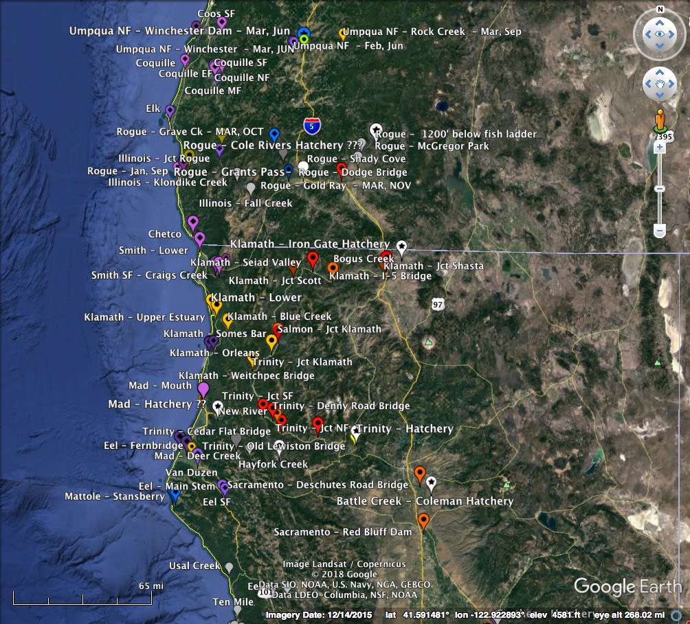
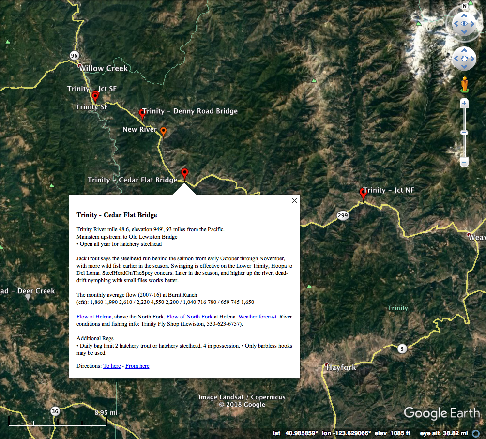

[Home](https://rhexman.github.io) > [Steelhead](https://rhexman.github.io/Steelhead/)

### Steelhead runs depicted by means of Google Earth overlays

[Download Overlays]

GE overlays offer a striking and efficient means of presenting and accessing complex data that are fundamentally geographic. They make use of the highly-developed interactive nature of Google Earth that allows the user quick change from overview to detail.  In particular, the ability to place locallized, labelled icons that expand to text, which in turn may contain links, allows a drilling down to levels way beyond the geographic.

These properties have been used in trying to make sense of the yearly runs of steelhead in the Pacific Northwest. As with all of the projects on this site, the present overlays should be viewed as works-in-progress, and community involvement is invited.  GE overlays are implemented as .kml files, which are human readable in the way that markup files are in general, but for most purposes, one can simply use the high-level editing capabilities of GE itself to modify and extend the overlays presented here.

__A medium overview example__

__And a medium closeup__

Much of the data reported in the overlays is referenced internally in the text as links to the data source.  Because of space considerations on GitHub, I have been hesitant to put primary data in the repository (which you can get to by clicking on the "View on GitHub" button in the page header above).  However, I have tried to organize links to the sources there.

### Detailed description from the overlay information pane

__California and Oregon Steelhead Runs - Rich Miller - April 16, 2018__

This collection of Google Earth overlays provides a depiction of the timing and magnitude of the principal steelhead runs of these two states, and reflects three primary sources of data: passage or fish trap counts, steelhead report card summaries, and guide consensus. The first type is reliable and quite complete, the second much less so, but is available for far more locations, and the third will almost certainly be relatively accurate in timing, but probably overstated in magnitude. In recent years, especially in Oregon, continuous video recording of fish passing windows in fish ladders, followed by human viewing and counting yields essentially perfect data. In contrast, angler reporting is frequently inaccurate and often very incomplete. In a 2007 report to the California Legislature, the DFW estimated that although reporting was mandatory, only about 1/3 of the anglers who had report cards returned them. In Oregon, return of the report card is optional. Thus, you should assume that the angler catch data in the overlays is a severe under-representation of the true count of the fish caught. However, it still may quite accurately give relative monthly activity. In particular, although reported counts certainly reflect the number of anglers who choose to fish at a given time and place, their choice to do so is prejudiced by local, historical knowledge, which means counts go up when there are a lot of fish to be caught, and down when there are few.

In the overlays, average monthly run timing and magnitude are encoded by the coloring, size, and decoration of the balloon icons. Twelve colors in spectral order (purple, blue, green, yellow, orange, red) correspond to the months of the year (January to December) when activity was maximal. Larger balloons reflect greater activity. Balloon decorations are stars, diamonds, circles, squares, or none. Starred icons denote locations of fish passage or hatchery entrapment counts, diamonds denote places where the principle catch was winter steelhead (fish sexually mature when they left the ocean), circles, where it was summer steelhead, and squares where there were significant winter and summer catches. Balloons with no decoration have a special meaning. They represent locations without count data, but are noted because the fishing regulations change there. When it seems reasonable, their colors are inferred from nearby locations; otherwise they are colored gray.

If you single click on a balloon, it opens up to a text window. If you double click, Google Earth flies you to a close-up of the location, and there opens the text window. For passage or entrapment locations, you see a line of the form "Steelhead: 5 7 47 / 121 399 988 / 940 157 80 / 151 54 \_". The numbers are the average counts for the months January through December. The groups of three divided by the slashes are therefore the seasons Winter, Spring, Summer, and Fall. An underscore means either zero, or no data. These locations also have a text line indicating the location and elevation, and, if the river does not empty directly into the ocean, the total distance by water to the ocean.

For catch report locations, the text gives the average monthly catch, coded as above, separately for winter and summer steelhead if the data supports that separation. These locations also give location information, and usually provide underlined links (blue or purple). If you click on a link, the web page opens (a bit slowly), replacing the Google Earth display. To get back, click the "Back to Google Earth" button at the top left of the screen. These locations also contain text at the top giving the open season for steelhead, and at the bottom, giving additional regulations relevant to anadromous salmonids.

Regulation change locations give just the open season and the additional regulations, as well as location data.
